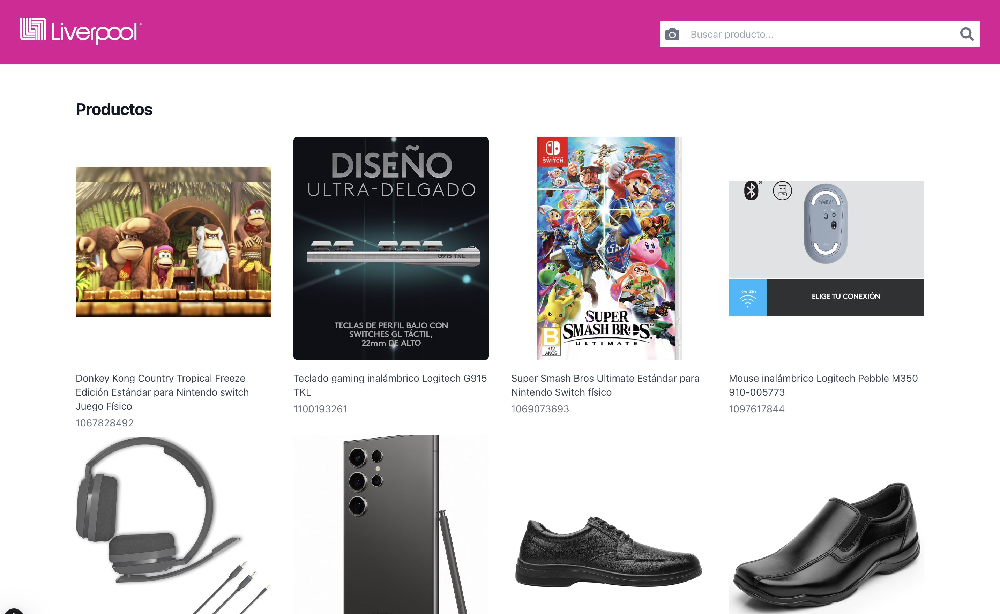
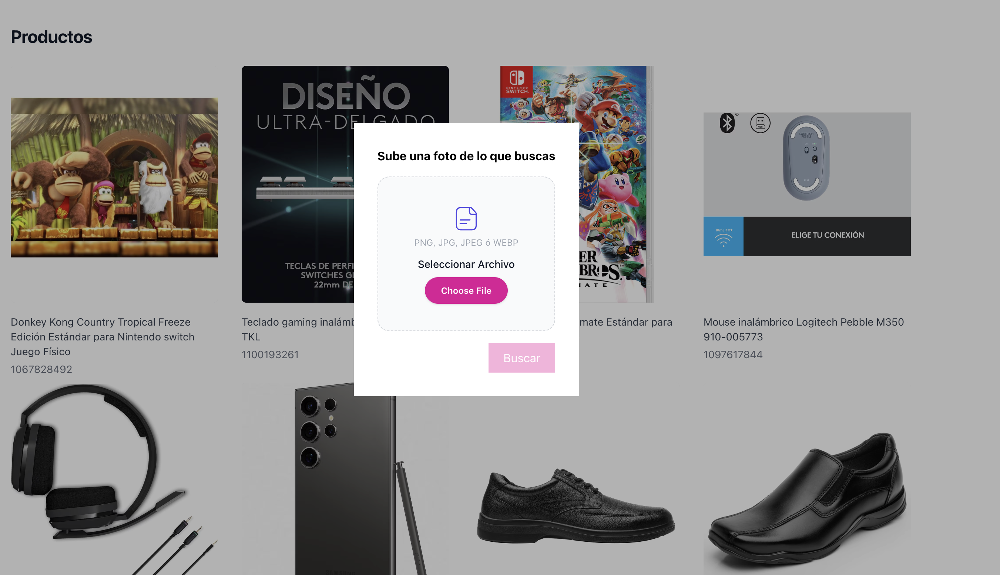
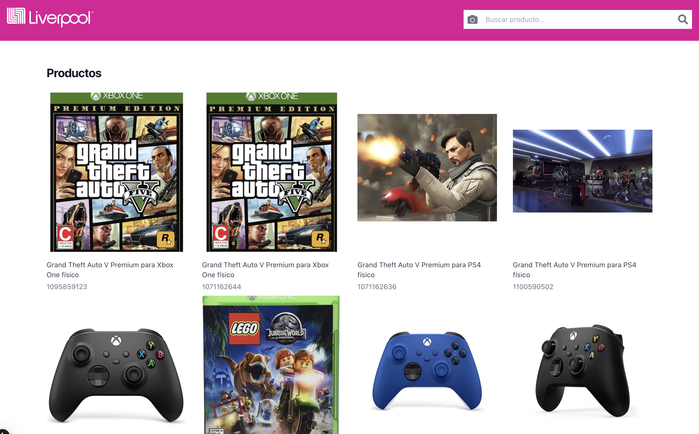

# Reto Liverpool

### Características del reto:
- Tienda en línea
- Buscador con imágenes
- Usar inteligencia artificial


### Iniciar modo desarrollo:
```
npm run dev
```

### Construir el build:
```
npm run build
```

### Variables .env necesarias:

```
DB_URI=mongodb+srv://<user>:<password>@<cluster>.mongodb.net"
OPENAI_KEY=<OpenAI Key>
```

#### Tecnologías utilizadas:
- Nextjs
- Reactjs
- TailwindCss
- MongoDB - Atlas Search
- Open AI - Vision

### Screenshots:

#### Main Page:


#### Search Drawer:


#### Example Image:


#### Search Results:
